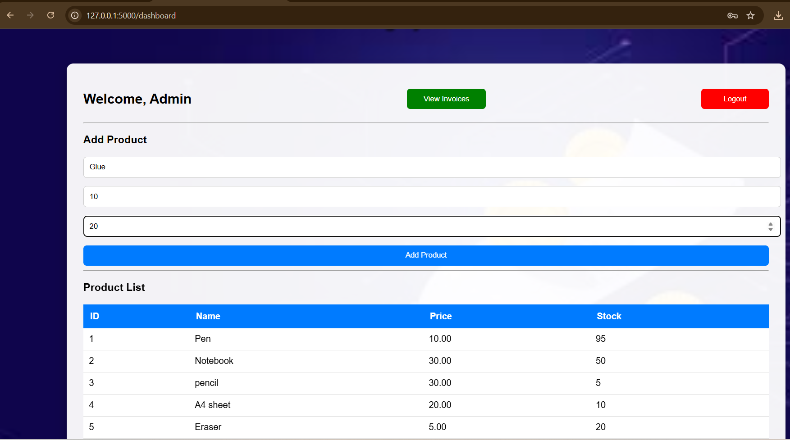
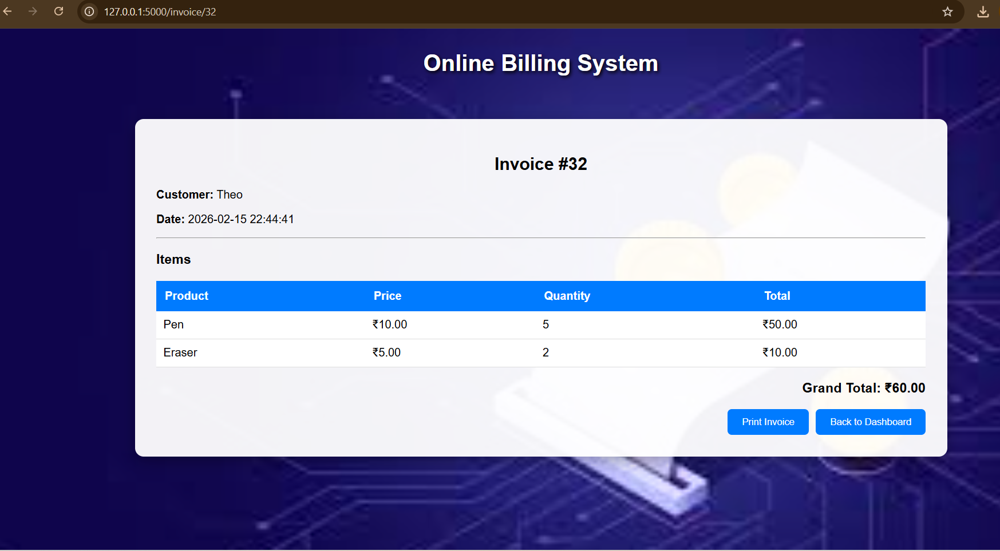
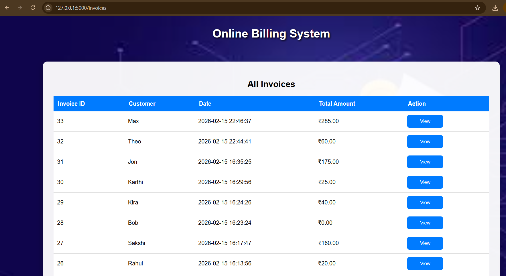

# 🧾 Online Billing System (Flask + MySQL)

A billing management system built using Flask and MySQL to manage products, generate invoices, and track stock automatically.

## 🚀 Features

- Admin Login System
- Product Management
- Multi-product Invoice Generation
- Automatic Stock Update
- Invoice History Page
- Printable Invoice

## 🛠 Tech Stack

- Python (Flask)
- MySQL
- HTML / CSS
- Jinja Templates

## 📸 Screenshots

### Login Page

### Dashboard

### Invoice Page

### All Invoices

## 👩‍💻 Author

Bhumika
